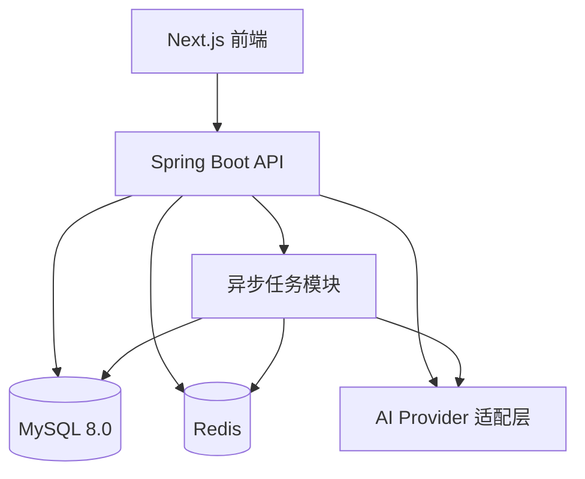

# Java 版技术选型文档

## 1. 技术选型目标

本项目定位为 B2B 智能主动获客与销售管理 SaaS 系统，后端采用 Java 技术栈，数据库采用 MySQL。

技术选型目标：

- 适合企业级 SaaS 系统长期演进。
- 支持多租户、权限、线索、CRM、AI 调用、异步任务等复杂业务。
- 开发效率和稳定性兼顾。
- MVP 阶段架构不过度复杂，后续可平滑拆分微服务。
- 方便国内团队招聘、维护和部署。

## 2. 总体技术栈

```text
前端：Next.js + React + TypeScript
后端：Java 21 + Spring Boot 3.x
数据库：MySQL 8.0
缓存：Redis
任务队列：Redis Stream / RabbitMQ
搜索：Elasticsearch / OpenSearch
向量检索：Milvus / Qdrant / Elasticsearch Vector
AI 接入：OpenAI-compatible API + 国产大模型适配层
部署：Docker + Nginx + Linux Server
CI/CD：GitHub Actions
```

## 3. 前端选型

### 3.1 核心框架

- Next.js。
- React。
- TypeScript。

### 3.2 UI 与交互

- Tailwind CSS。
- shadcn/ui 或 Ant Design。
- lucide-react 图标。
- ECharts / AntV 图表。

### 3.3 前端状态与请求

- TanStack Query：接口请求、缓存和列表刷新。
- Zustand：轻量全局状态。
- React Hook Form：表单管理。
- Zod：前端表单校验。

### 3.4 适用原因

- 适合构建复杂后台系统。
- TypeScript 能减少前后端协作成本。
- 组件生态成熟，适合快速做 MVP。

## 4. 后端选型

### 4.1 Java 版本

推荐使用 Java 21 LTS。

原因：

- 长期支持版本。
- 性能和语法体验更好。
- Spring Boot 3.x 生态支持成熟。

### 4.2 后端框架

推荐使用 Spring Boot 3.x。

核心依赖：

- Spring Web：REST API。
- Spring Security：认证与权限。
- Spring Validation：参数校验。
- Spring Data JPA 或 MyBatis-Plus：数据库访问。
- Spring Scheduler：轻量定时任务。
- Spring Boot Actuator：健康检查和监控。

### 4.3 ORM 选择

建议 MVP 阶段使用 MyBatis-Plus。

原因：

- 对国内 Java 团队更友好。
- SQL 可控，适合复杂筛选、线索列表和报表查询。
- 开发效率高。

可选方案：

- 简单 CRUD：MyBatis-Plus。
- 复杂报表：手写 SQL。
- 后续如果领域模型复杂，可局部引入 JPA。

### 4.4 API 风格

推荐 REST API。

配套：

- OpenAPI/Swagger 自动生成接口文档。
- 统一响应结构。
- 统一异常处理。
- 统一分页格式。
- 统一参数校验。

响应结构示例：

```json
{
  "code": 0,
  "message": "success",
  "data": {}
}
```

## 5. 数据库选型

### 5.1 主数据库

推荐 MySQL 8.0。

用途：

- 租户数据。
- 用户和权限。
- 线索数据。
- 企业客户画像。
- 联系人。
- 销售任务。
- 跟进记录。
- 商机和成交记录。
- AI 推荐结果。
- 操作日志。

### 5.2 MySQL 设计建议

- 使用 InnoDB。
- 所有业务表包含 `tenant_id`。
- 高频查询字段建立组合索引。
- 大文本内容单独字段或扩展表存储。
- 联系方式等敏感字段加密或脱敏存储。
- 重要状态变化保留日志表。

典型组合索引：

```text
tenant_id + status + owner_user_id
tenant_id + score + created_at
tenant_id + industry + region
tenant_id + company_id
tenant_id + next_follow_up_at
```

### 5.3 数据迁移

推荐使用 Flyway。

用途：

- 管理数据库 schema 版本。
- 支持多环境一致部署。
- 方便回溯历史结构变更。

## 6. 缓存与异步任务

### 6.1 Redis

用途：

- 登录 token 黑名单。
- 验证码。
- 热点数据缓存。
- 分布式锁。
- 限流。
- 导入任务进度。
- AI 批量评分任务状态。

### 6.2 任务队列

MVP 推荐：

- Redis Stream，简单、部署成本低。

成长阶段推荐：

- RabbitMQ，适合业务异步任务。
- Kafka，适合大规模事件流和数据分析。

异步任务场景：

- Excel/CSV 导入。
- 线索清洗。
- 联系方式校验。
- AI 批量评分。
- AI 话术生成。
- 邮件/短信发送。
- 数据同步。
- 报表统计。

## 7. 搜索与分析

### 7.1 搜索

MVP 阶段：

- MySQL 索引 + 条件筛选。

成长阶段：

- Elasticsearch / OpenSearch。

适用场景：

- 企业名称搜索。
- 联系人搜索。
- 多条件线索筛选。
- 标签筛选。
- 全文检索。
- 相似线索召回。

### 7.2 数据分析

MVP 阶段：

- MySQL 聚合查询。
- 定时任务生成统计表。

成长阶段：

- ClickHouse。

适用场景：

- 获客漏斗。
- 渠道 ROI。
- 销售业绩分析。
- 话术效果分析。
- AI 评分命中率分析。

## 8. AI 技术选型

### 8.1 大模型接入

建议设计统一 AI Provider 适配层。

可接入模型：

- OpenAI。
- Azure OpenAI。
- 通义千问。
- 智谱。
- DeepSeek。
- 私有化大模型。

后端不要在业务代码中直接绑定某一家模型 API，应通过统一接口调用。

### 8.2 AI 能力

MVP 阶段：

- 客户摘要生成。
- 线索评分解释。
- 销售话术生成。
- 跟进建议生成。
- 异议处理建议。

成长阶段：

- 成交概率预测。
- 渠道推荐。
- 话术 A/B 测试。
- 客户相似度分析。
- 销售动作推荐。

### 8.3 向量检索

MySQL 不适合作为长期向量数据库。

推荐方案：

- MVP 可先不做向量库，只保存 AI 生成结果。
- 需要相似客户、相似案例、话术召回时，引入 Milvus、Qdrant 或 Elasticsearch Vector。

向量化对象：

- 客户画像。
- 行业案例。
- 销售话术。
- 跟进记录摘要。
- 成交客户特征。

## 9. 后端模块划分

建议采用模块化单体架构起步。

```text
com.leadspark
├── auth          认证与权限
├── tenant        租户与组织
├── user          用户与成员
├── lead          线索
├── company       企业客户
├── contact       联系人
├── profile       客户画像
├── task          销售任务
├── crm           跟进与商机
├── ai            AI 能力
├── analytics     数据分析
├── integration   第三方集成
├── importexport  导入导出
└── common        通用能力
```

## 10. 推荐 MVP 架构



MVP 阶段只需要：

- 一个前端应用。
- 一个 Spring Boot 后端应用。
- 一个 MySQL。
- 一个 Redis。
- 一个 AI Provider 接口。

暂时不建议一开始上微服务、Kubernetes、独立数据仓库和独立模型训练平台。

## 11. 推荐开发优先级

### 11.1 第一阶段

- 用户登录。
- 租户和成员管理。
- 线索导入。
- 线索列表。
- 客户详情。
- AI 评分。
- AI 话术生成。
- 销售任务。
- 跟进记录。
- 基础看板。

### 11.2 第二阶段

- 线索自动清洗。
- 客户画像标签。
- 商机管理。
- 短信/邮件集成。
- 企微跟进记录。
- 话术模板管理。

### 11.3 第三阶段

- Elasticsearch/OpenSearch。
- Milvus/Qdrant。
- ClickHouse。
- AI 优化引擎。
- 渠道推荐。
- 评分模型训练。

## 12. 最终推荐组合

```text
前端：Next.js + TypeScript + Tailwind CSS + shadcn/ui
后端：Java 21 + Spring Boot 3.x + MyBatis-Plus
数据库：MySQL 8.0
缓存：Redis
队列：Redis Stream，后续升级 RabbitMQ/Kafka
搜索：MySQL 起步，后续 Elasticsearch/OpenSearch
AI：统一 AI Provider 适配层
向量库：后续 Milvus/Qdrant
部署：Docker + Nginx + GitHub Actions
```

这套技术栈适合先快速做出可用 MVP，同时保留后续扩展到企业级 SaaS 和 AI 智能优化平台的空间。
