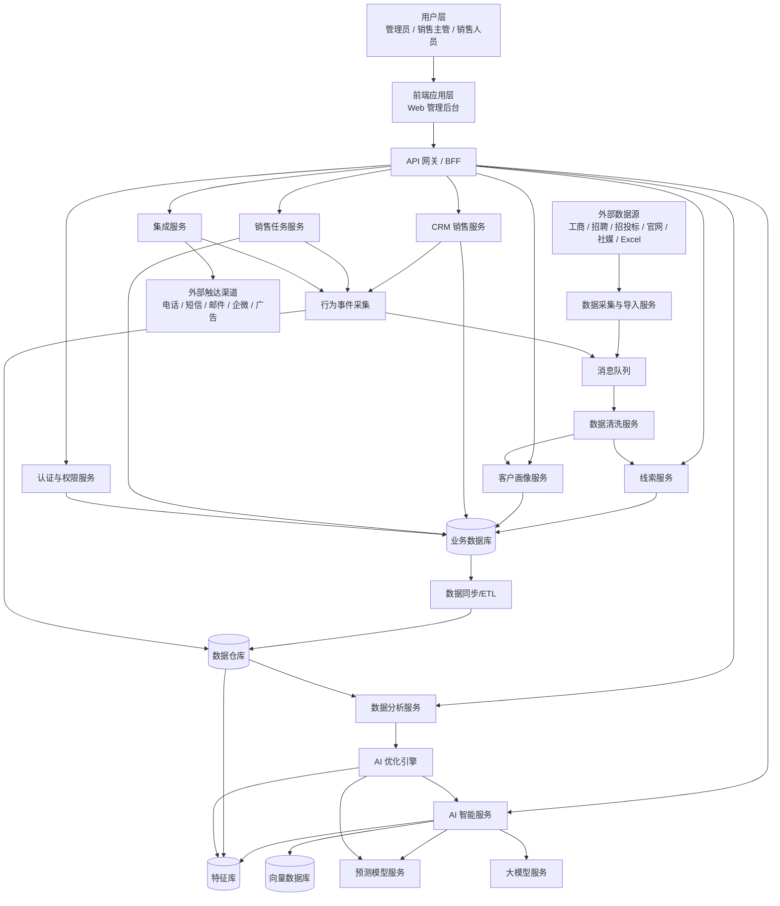
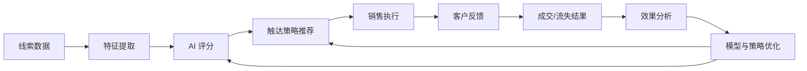
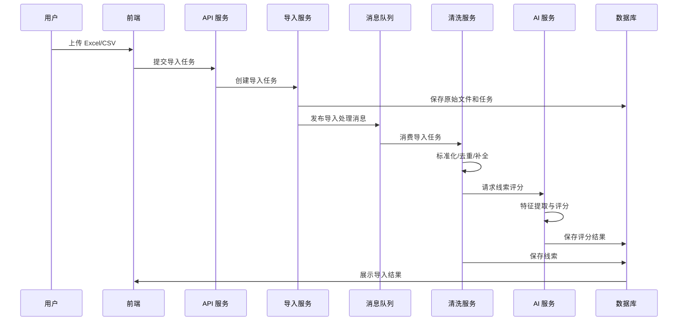
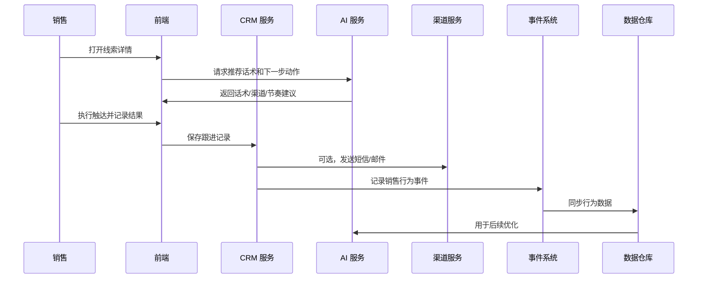
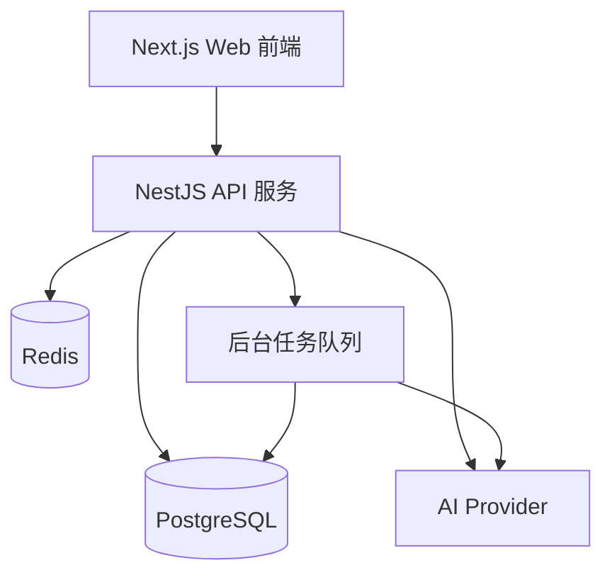

# 智能主动获客销售系统架构文档

## 1. 架构目标

本系统面向 B2B 主动获客和智能销售场景，架构设计目标如下：

- 支持多渠道线索采集、导入和清洗。
- 支持 SaaS 多租户企业使用。
- 支持 AI 线索评分、话术生成和策略优化。
- 支持销售任务、跟进记录和商机管理。
- 支持数据反馈闭环，持续优化获客效率。
- 支持后续接入外呼、企微、短信、邮件、广告等渠道。

## 2. 总体架构图



## 3. 分层架构

### 3.1 用户体验层

主要承载销售和管理人员的日常操作。

模块：

- Web 管理后台。
- 移动端 H5，后续可选。
- 销售助手插件，后续可选。

核心页面：

- 工作台。
- 线索中心。
- 客户画像。
- 销售任务。
- 商机管理。
- 数据分析。
- 系统设置。

### 3.2 接入层

统一处理前端请求、第三方回调和开放接口。

组件：

- API 网关。
- BFF，Backend For Frontend。
- Open API。
- Webhook 接收器。

职责：

- 请求路由。
- 鉴权。
- 限流。
- 参数校验。
- 接口聚合。
- 多租户上下文注入。

### 3.3 业务服务层

承载核心业务能力。

服务：

- 认证与权限服务。
- 组织与成员服务。
- 线索服务。
- 客户画像服务。
- 销售任务服务。
- CRM 商机服务。
- 话术模板服务。
- 数据分析服务。
- 通知服务。
- 集成服务。

### 3.4 AI 智能层

承载智能评分、生成和优化能力。

服务：

- 线索评分服务。
- 客户画像生成服务。
- 意图信号识别服务。
- 销售话术生成服务。
- 渠道推荐服务。
- 跟进节奏推荐服务。
- 成交概率预测服务。
- AI 优化引擎。

### 3.5 数据处理层

负责采集、清洗、加工和同步数据。

组件：

- 数据采集服务。
- Excel/CSV 导入服务。
- 数据清洗服务。
- 去重合并服务。
- 标签生成服务。
- 特征加工任务。
- ETL/ELT 任务。

### 3.6 数据存储层

根据不同数据类型选择不同存储。

存储：

- 业务数据库：PostgreSQL/MySQL。
- 缓存：Redis。
- 搜索引擎：Elasticsearch/OpenSearch。
- 对象存储：S3/OSS/COS。
- 向量数据库：pgvector/Milvus/Qdrant。
- 数据仓库：ClickHouse/BigQuery/Snowflake。
- 消息队列：Kafka/RabbitMQ/SQS。

## 4. 核心服务设计

### 4.1 线索服务

职责：

- 线索创建。
- 线索导入。
- 线索查询。
- 线索分配。
- 线索状态管理。
- 线索去重。
- 线索评分结果保存。

核心实体：

- Lead。
- LeadSource。
- LeadContact。
- LeadScore。
- LeadAssignment。
- LeadStatusLog。

### 4.2 客户画像服务

职责：

- 企业基础信息管理。
- 联系人管理。
- 标签管理。
- 需求信号管理。
- 客户画像快照。
- 客户相似度计算。

核心实体：

- Company。
- Contact。
- CompanyProfile。
- CompanyTag。
- IntentSignal。
- ProfileSnapshot。

### 4.3 CRM 销售服务

职责：

- 客户跟进记录。
- 商机管理。
- 销售阶段管理。
- 成交记录。
- 流失原因记录。
- 公海池管理。

核心实体：

- FollowUpRecord。
- Opportunity。
- PipelineStage。
- Deal。
- LostReason。
- CustomerPool。

### 4.4 销售任务服务

职责：

- 自动生成触达任务。
- 管理待办事项。
- 跟进提醒。
- 逾期提醒。
- 销售动作记录。

核心实体：

- SalesTask。
- TaskRule。
- TaskReminder。
- TaskResult。

### 4.5 AI 智能服务

职责：

- 线索评分。
- 评分解释。
- 话术生成。
- 客户摘要生成。
- 渠道推荐。
- 跟进节奏推荐。
- 异议处理建议。

能力拆分：

- LLM 生成能力：用于摘要、话术、策略说明。
- 预测模型能力：用于评分、成交概率、客户价值预测。
- 规则引擎能力：用于可解释、可控的业务规则。
- 向量检索能力：用于相似客户、案例和话术检索。

### 4.6 AI 优化引擎

职责：

- 分析不同线索特征与成交结果的关系。
- 分析渠道、话术、销售动作的转化效果。
- 调整线索评分权重。
- 推荐更优触达策略。
- 生成运营优化建议。

输入：

- 线索特征。
- AI 评分。
- 触达行为。
- 客户回复。
- 商机阶段变化。
- 成交/流失结果。
- 销售人员行为。

输出：

- 评分模型更新建议。
- 话术模板优化建议。
- 渠道优先级调整。
- ICP 规则修正建议。
- 销售动作推荐。

## 5. AI 智能优化机制

### 5.1 闭环结构



### 5.2 线索评分优化

初期可采用规则评分 + LLM 解释。

示例权重：

```text
ICP 匹配度：30%
行业匹配度：15%
企业规模：10%
近期需求信号：20%
联系方式完整度：10%
历史相似客户成交率：10%
渠道质量：5%
```

成熟后引入机器学习模型：

- Logistic Regression。
- XGBoost/LightGBM。
- Learning to Rank。
- 深度学习排序模型，后续可选。

模型目标：

- 预测回复概率。
- 预测意向概率。
- 预测商机转化概率。
- 预测成交概率。
- 预测客户生命周期价值。

### 5.3 话术优化

系统对不同话术进行效果追踪。

指标：

- 发送量。
- 打开率。
- 回复率。
- 正向回复率。
- 预约率。
- 商机转化率。
- 成交率。

优化方式：

- 按行业生成差异化话术。
- 按职位生成差异化话术。
- 按客户信号生成个性化开场。
- 对话术做 A/B 测试。
- 将高转化话术沉淀为模板。
- 将低转化话术降权或淘汰。

### 5.4 渠道优化

系统根据历史表现推荐不同客户适合的触达渠道。

示例：

```text
制造业中型企业：电话 + 企微
软件服务企业：邮件 + LinkedIn/内容触达
本地生活商家：电话 + 短信
高客单价客户：销售顾问人工触达 + 行业案例
```

优化依据：

- 客户类型。
- 行业。
- 企业规模。
- 联系人职位。
- 触达时间。
- 历史渠道转化率。
- 客户回复偏好。

### 5.5 销售动作优化

系统分析优秀销售行为，反向推荐给团队。

可分析行为：

- 首次触达时间。
- 跟进间隔。
- 跟进次数。
- 使用话术。
- 发送资料。
- 预约时机。
- 报价时机。

输出：

- 最佳跟进节奏。
- 推荐下一步动作。
- 高风险商机提醒。
- 长时间未跟进提醒。
- 成交概率变化提示。

## 6. 数据流设计

### 6.1 线索导入数据流



### 6.2 销售触达数据流



## 7. 推荐技术选型

### 7.1 前端

- React / Next.js。
- TypeScript。
- Tailwind CSS 或企业级组件库。
- ECharts / AntV 用于数据可视化。

### 7.2 后端

- Node.js NestJS 或 Java Spring Boot。
- REST API，后续可补 GraphQL。
- OpenAPI/Swagger 文档。
- RBAC 权限模型。

### 7.3 数据库与中间件

- PostgreSQL：主业务数据库。
- Redis：缓存、限流、任务状态。
- Elasticsearch/OpenSearch：线索搜索和复杂筛选。
- Kafka/RabbitMQ：异步任务和事件流。
- ClickHouse：分析型数据仓库。
- pgvector/Milvus：向量检索。

### 7.4 AI 与模型

- 大模型：OpenAI / Azure OpenAI / 通义千问 / 智谱 / DeepSeek，可按部署和合规要求选择。
- Embedding：用于客户画像、案例、话术模板向量化。
- 规则引擎：用于早期可控评分。
- 机器学习模型：LightGBM/XGBoost 用于成熟期评分优化。
- Prompt 模板管理：版本化管理话术和摘要生成提示词。

### 7.5 部署

- Docker。
- Kubernetes，成长阶段引入。
- 云数据库。
- 对象存储。
- CI/CD。
- 日志与监控。

## 8. 数据模型草案

### 8.1 Tenant

```text
id
name
plan
status
created_at
updated_at
```

### 8.2 User

```text
id
tenant_id
name
mobile
email
role
status
created_at
updated_at
```

### 8.3 Lead

```text
id
tenant_id
company_id
source
source_ref
status
owner_user_id
score
grade
score_reason
created_at
updated_at
```

### 8.4 Company

```text
id
tenant_id
name
industry
region
scale
registered_capital
founded_at
website
description
created_at
updated_at
```

### 8.5 Contact

```text
id
tenant_id
company_id
name
title
department
mobile
email
wechat
confidence
created_at
updated_at
```

### 8.6 IntentSignal

```text
id
tenant_id
company_id
signal_type
signal_source
content
signal_time
weight
created_at
```

### 8.7 FollowUpRecord

```text
id
tenant_id
lead_id
user_id
channel
content
result
next_action
next_follow_up_at
created_at
```

### 8.8 Opportunity

```text
id
tenant_id
lead_id
company_id
owner_user_id
stage
amount
probability
expected_close_date
status
lost_reason
created_at
updated_at
```

### 8.9 AiRecommendation

```text
id
tenant_id
target_type
target_id
recommendation_type
content
model_name
prompt_version
confidence
created_at
```

### 8.10 EventLog

```text
id
tenant_id
user_id
event_type
target_type
target_id
properties
created_at
```

## 9. 多租户设计

建议 MVP 阶段采用共享数据库、共享表、tenant_id 隔离方案。

关键要求：

- 所有核心业务表必须包含 tenant_id。
- 所有查询必须注入 tenant_id 条件。
- 文件存储按 tenant_id 分目录。
- 缓存 key 包含 tenant_id。
- 定时任务按 tenant_id 隔离处理。
- 管理后台支持租户级配置。

后续大客户可升级为独立数据库或独立部署。

## 10. 权限设计

采用 RBAC 权限模型。

角色：

- Super Admin。
- Tenant Admin。
- Sales Manager。
- Sales Rep。

权限资源：

- lead。
- company。
- contact。
- task。
- opportunity。
- analytics。
- setting。
- integration。

权限动作：

- read。
- create。
- update。
- delete。
- assign。
- export。
- import。
- manage。

## 11. 安全与合规设计

### 11.1 数据安全

- 密码哈希存储。
- 敏感联系方式加密存储。
- 数据传输使用 HTTPS。
- 数据导出权限控制。
- 操作日志审计。
- 管理员高危操作二次确认。

### 11.2 合规控制

- 记录线索来源。
- 支持退订和拒绝触达标记。
- 支持黑名单。
- 控制短信和邮件触达频率。
- 限制外呼时间段。
- 支持数据删除和匿名化。

## 12. 可观测性

日志：

- 请求日志。
- 错误日志。
- AI 调用日志。
- 任务执行日志。
- 第三方接口日志。

指标：

- API 响应时间。
- 队列堆积量。
- 导入成功率。
- AI 调用成功率。
- 模型评分耗时。
- 第三方渠道发送成功率。

告警：

- API 错误率过高。
- AI 服务不可用。
- 队列积压。
- 导入任务失败。
- 短信/邮件发送失败。
- 数据库连接异常。

## 13. MVP 实施架构

为了快速验证业务，MVP 可采用单体模块化架构。



MVP 模块：

- 登录与成员。
- 线索导入。
- 线索列表。
- 客户画像。
- AI 评分。
- AI 话术。
- 销售任务。
- 跟进记录。
- 基础看板。

MVP 不建议一开始拆太多微服务。可以先用模块化单体，等数据量、团队规模和外部集成复杂度上来后，再逐步拆分。

## 14. 迭代路线

### 14.1 第一阶段：业务闭环验证

- Excel/CSV 导入。
- 线索清洗。
- 基础画像。
- AI 评分。
- AI 话术。
- 销售跟进。
- 成交/流失反馈。
- 基础数据看板。

### 14.2 第二阶段：渠道和自动化

- 短信接口。
- 邮件接口。
- 外呼系统集成。
- 企业微信集成。
- 自动跟进任务。
- 话术 A/B 测试。

### 14.3 第三阶段：智能优化

- 特征库。
- 评分模型训练。
- 渠道推荐模型。
- 销售动作推荐。
- 行业策略模板。
- AI 优化建议中心。

### 14.4 第四阶段：平台化

- Open API。
- 第三方 CRM 集成。
- 多租户高级权限。
- 独立部署支持。
- 数据市场。
- 多智能体销售助手。
