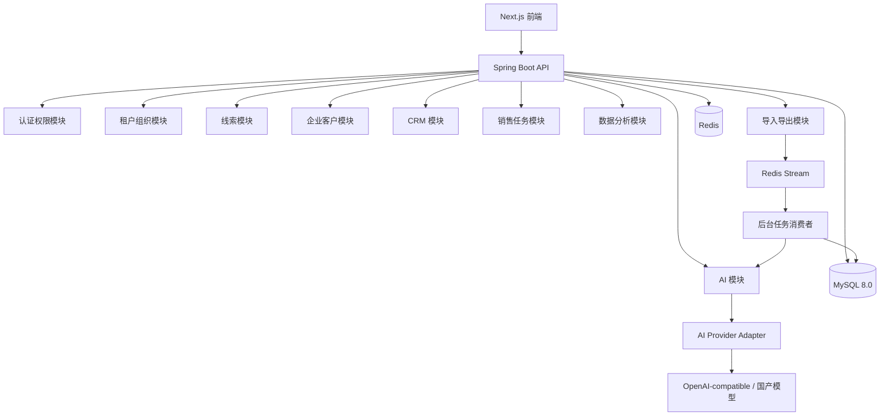
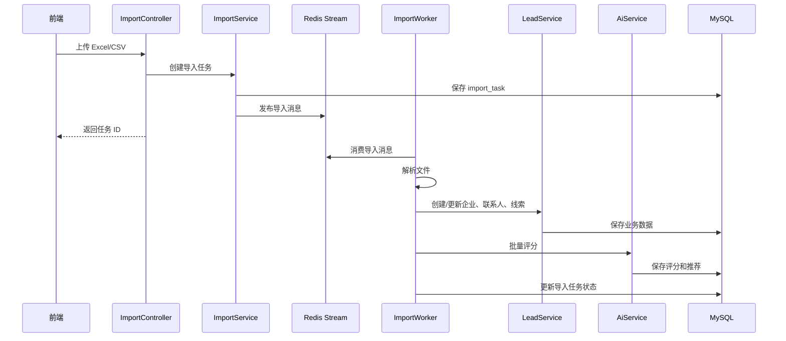
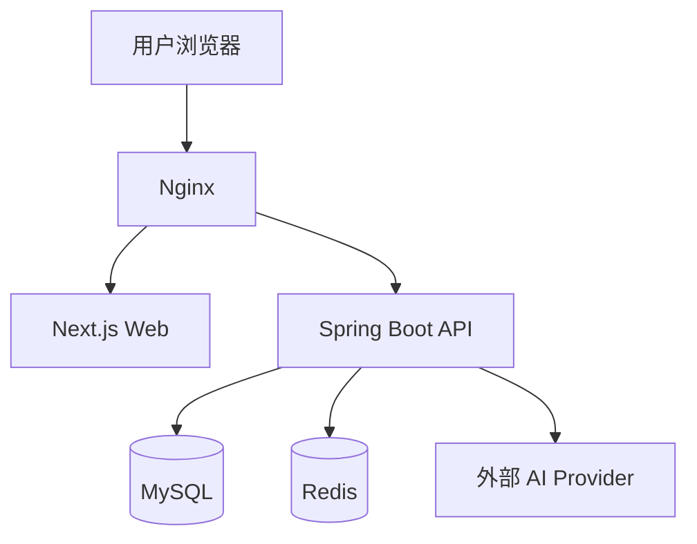

# 智能主动获客销售系统详细设计文档

## 1. 文档说明

本文档基于当前技术架构编写，用于指导 MVP 到第一阶段产品研发落地。

当前核心技术选型：

```text
前端：Next.js + React + TypeScript
后端：Java 21 + Spring Boot 3.x
数据库：MySQL 8.0
缓存：Redis
任务队列：Redis Stream，后续可升级 RabbitMQ/Kafka
搜索：MySQL 起步，后续 Elasticsearch/OpenSearch
AI：统一 AI Provider 适配层
向量库：后续 Milvus/Qdrant/Elasticsearch Vector
部署：Docker + Nginx + GitHub Actions
```

## 2. 设计目标

### 2.1 MVP 目标

- 支持企业用户登录和成员管理。
- 支持线索导入、清洗、去重和基础画像生成。
- 支持 AI 线索评分和评分解释。
- 支持 AI 生成销售话术和跟进建议。
- 支持销售任务、跟进记录、客户状态流转。
- 支持基础数据看板。
- 支持成交/流失反馈，形成 AI 优化闭环的数据基础。

### 2.2 架构目标

- 采用模块化单体，降低 MVP 复杂度。
- 核心表均支持多租户隔离。
- 业务事件统一沉淀，为后续数据分析和模型优化服务。
- AI 能力通过适配层接入，避免绑定单一模型厂商。
- 异步任务独立处理导入、AI 批量评分和统计任务。

## 3. 系统边界

### 3.1 MVP 包含范围

- 用户认证与权限。
- 租户组织。
- 线索导入。
- 企业客户管理。
- 联系人管理。
- 客户画像。
- AI 评分。
- AI 话术。
- 销售任务。
- 跟进记录。
- 商机基础管理。
- 数据看板。
- 操作日志和业务事件。

### 3.2 MVP 暂不包含

- 自动外呼。
- 自动添加企微。
- 大规模爬虫采集。
- 独立数据仓库。
- 独立机器学习训练平台。
- 复杂 SCRM。
- 多智能体自动销售。

## 4. 总体实现架构



## 5. 后端模块设计

后端包结构建议：

```text
com.leadspark
├── LeadsparkApplication.java
├── common
├── config
├── security
├── tenant
├── user
├── auth
├── lead
├── company
├── contact
├── profile
├── crm
├── task
├── ai
├── analytics
├── importexport
├── integration
└── event
```

### 5.1 common 通用模块

职责：

- 统一响应结构。
- 统一异常处理。
- 分页对象。
- 枚举定义。
- 时间处理。
- 脱敏工具。
- 加解密工具。
- 多租户上下文。

关键类：

```text
ApiResponse<T>
PageRequest
PageResult<T>
BizException
ErrorCode
TenantContext
CurrentUser
```

### 5.2 security 安全模块

职责：

- JWT 解析。
- 登录态校验。
- 权限拦截。
- 密码加密。
- 接口访问控制。

关键设计：

- 使用 Spring Security。
- Access Token 建议有效期 2 小时。
- Refresh Token 建议有效期 7-30 天。
- Redis 存储 token 黑名单和登录会话状态。

### 5.3 tenant 租户模块

职责：

- 租户创建。
- 租户状态管理。
- 租户配置。
- 套餐限制。

核心能力：

- 每个业务请求必须绑定 `tenant_id`。
- 所有业务数据查询必须带 `tenant_id`。
- 企业管理员只能查看本租户数据。

### 5.4 user 用户模块

职责：

- 成员管理。
- 角色分配。
- 用户启用/禁用。
- 用户基础资料。

角色：

- `SUPER_ADMIN`：平台超级管理员。
- `TENANT_ADMIN`：企业管理员。
- `SALES_MANAGER`：销售主管。
- `SALES_REP`：销售人员。

### 5.5 lead 线索模块

职责：

- 线索创建。
- 线索导入。
- 线索查询。
- 线索分配。
- 线索状态流转。
- 线索评分结果保存。

核心状态：

```text
NEW           新线索
ASSIGNED      已分配
CONTACTED     已触达
RESPONDED     有回复
INTERESTED    有意向
CONVERTED     已转商机
WON           已成交
LOST          已流失
INVALID       无效
```

### 5.6 company 企业客户模块

职责：

- 企业基础信息。
- 企业画像字段。
- 企业标签。
- 企业需求信号。
- 企业去重。

去重规则：

- 优先按统一社会信用代码去重。
- 其次按企业名称标准化结果去重。
- 再按官网、电话等辅助字段判断。

### 5.7 contact 联系人模块

职责：

- 联系人信息管理。
- 联系方式管理。
- 联系方式脱敏展示。
- 联系人可信度标记。

敏感字段：

- 手机号。
- 邮箱。
- 微信号。

处理要求：

- 数据库存储建议加密。
- 普通销售列表页默认脱敏。
- 详情页按权限展示完整信息。
- 导出需要单独权限。

### 5.8 profile 客户画像模块

职责：

- 汇总企业、联系人、标签、需求信号、跟进记录。
- 生成客户画像摘要。
- 保存画像快照。

画像生成触发：

- 线索导入完成。
- 企业信息更新。
- 新增需求信号。
- 关键跟进记录更新。
- 成交/流失状态变化。

### 5.9 ai AI 模块

职责：

- 线索评分。
- 评分解释。
- 话术生成。
- 客户摘要。
- 下一步动作推荐。
- Prompt 模板管理。
- AI 调用日志。

AI 模块必须通过统一接口调用模型：

```text
AiProvider
├── chat(request)
├── embedding(request)
└── moderate(request)
```

业务侧不得直接调用具体模型 SDK。

### 5.10 task 销售任务模块

职责：

- 任务创建。
- 任务分配。
- 任务提醒。
- 任务完成。
- 逾期任务查询。

任务类型：

```text
CALL        电话
EMAIL       邮件
WECHAT      企微/微信
SMS         短信
FOLLOW_UP   跟进
MEETING     会议
QUOTE       报价
```

### 5.11 crm CRM 模块

职责：

- 跟进记录。
- 客户状态变化。
- 商机创建。
- 商机阶段流转。
- 成交记录。
- 流失原因。

商机阶段：

```text
QUALIFIED     已确认需求
DEMO          已演示
PROPOSAL      已报价/方案
NEGOTIATION   谈判中
WON           已赢单
LOST          已输单
```

### 5.12 analytics 数据分析模块

职责：

- 工作台指标。
- 线索漏斗。
- 渠道分析。
- 销售分析。
- 话术分析。
- AI 评分效果分析。

MVP 阶段：

- 使用 MySQL 聚合查询。
- 对高频看板使用定时统计表。

### 5.13 importexport 导入导出模块

职责：

- Excel/CSV 上传。
- 字段映射。
- 导入任务创建。
- 异步解析。
- 导入结果查看。
- 错误行下载。

导入流程：

```text
上传文件
  -> 创建导入任务
  -> 保存原始文件
  -> 发布 Redis Stream 消息
  -> 后台解析文件
  -> 标准化字段
  -> 去重
  -> 创建企业/联系人/线索
  -> 调用 AI 批量评分
  -> 更新导入结果
```

## 6. 数据库详细设计

### 6.1 设计规范

- 所有业务表使用 InnoDB。
- 主键使用 `BIGINT`，可采用雪花 ID 或数据库自增。
- 所有租户业务表必须包含 `tenant_id`。
- 所有表包含 `created_at`、`updated_at`。
- 软删除字段统一使用 `deleted`，0 表示未删除，1 表示已删除。
- 状态字段使用 `VARCHAR(32)`，便于枚举扩展。
- 金额使用 `DECIMAL(18,2)`。
- JSON 扩展字段使用 MySQL `JSON` 类型。

### 6.2 核心表清单

```text
tenant
user_account
role
user_role
lead
company
contact
company_tag
intent_signal
lead_score
customer_profile_snapshot
sales_task
follow_up_record
opportunity
ai_prompt_template
ai_recommendation
ai_call_log
import_task
import_task_error
event_log
analytics_daily_stat
```

### 6.3 tenant 租户表

```sql
CREATE TABLE tenant (
  id BIGINT PRIMARY KEY,
  name VARCHAR(128) NOT NULL,
  plan VARCHAR(32) NOT NULL DEFAULT 'FREE',
  status VARCHAR(32) NOT NULL DEFAULT 'ACTIVE',
  settings JSON NULL,
  created_at DATETIME NOT NULL,
  updated_at DATETIME NOT NULL
) ENGINE=InnoDB DEFAULT CHARSET=utf8mb4;
```

### 6.4 user_account 用户表

```sql
CREATE TABLE user_account (
  id BIGINT PRIMARY KEY,
  tenant_id BIGINT NOT NULL,
  name VARCHAR(64) NOT NULL,
  mobile VARCHAR(128) NULL,
  email VARCHAR(128) NULL,
  password_hash VARCHAR(255) NOT NULL,
  status VARCHAR(32) NOT NULL DEFAULT 'ACTIVE',
  last_login_at DATETIME NULL,
  deleted TINYINT NOT NULL DEFAULT 0,
  created_at DATETIME NOT NULL,
  updated_at DATETIME NOT NULL,
  KEY idx_user_tenant_status (tenant_id, status),
  KEY idx_user_email (email),
  KEY idx_user_mobile (mobile)
) ENGINE=InnoDB DEFAULT CHARSET=utf8mb4;
```

### 6.5 lead 线索表

```sql
CREATE TABLE lead (
  id BIGINT PRIMARY KEY,
  tenant_id BIGINT NOT NULL,
  company_id BIGINT NOT NULL,
  primary_contact_id BIGINT NULL,
  source VARCHAR(64) NOT NULL,
  source_ref VARCHAR(128) NULL,
  status VARCHAR(32) NOT NULL DEFAULT 'NEW',
  owner_user_id BIGINT NULL,
  score INT NOT NULL DEFAULT 0,
  grade VARCHAR(8) NULL,
  score_reason TEXT NULL,
  last_follow_up_at DATETIME NULL,
  next_follow_up_at DATETIME NULL,
  deleted TINYINT NOT NULL DEFAULT 0,
  created_at DATETIME NOT NULL,
  updated_at DATETIME NOT NULL,
  KEY idx_lead_tenant_status_owner (tenant_id, status, owner_user_id),
  KEY idx_lead_tenant_score (tenant_id, score, created_at),
  KEY idx_lead_company (tenant_id, company_id),
  KEY idx_lead_next_follow (tenant_id, next_follow_up_at)
) ENGINE=InnoDB DEFAULT CHARSET=utf8mb4;
```

### 6.6 company 企业表

```sql
CREATE TABLE company (
  id BIGINT PRIMARY KEY,
  tenant_id BIGINT NOT NULL,
  name VARCHAR(255) NOT NULL,
  normalized_name VARCHAR(255) NOT NULL,
  credit_code VARCHAR(64) NULL,
  industry VARCHAR(128) NULL,
  region VARCHAR(128) NULL,
  scale VARCHAR(64) NULL,
  registered_capital VARCHAR(64) NULL,
  founded_at DATE NULL,
  website VARCHAR(255) NULL,
  description TEXT NULL,
  data_quality_score INT NOT NULL DEFAULT 0,
  deleted TINYINT NOT NULL DEFAULT 0,
  created_at DATETIME NOT NULL,
  updated_at DATETIME NOT NULL,
  KEY idx_company_tenant_name (tenant_id, normalized_name),
  KEY idx_company_tenant_industry_region (tenant_id, industry, region),
  KEY idx_company_credit_code (tenant_id, credit_code)
) ENGINE=InnoDB DEFAULT CHARSET=utf8mb4;
```

### 6.7 contact 联系人表

```sql
CREATE TABLE contact (
  id BIGINT PRIMARY KEY,
  tenant_id BIGINT NOT NULL,
  company_id BIGINT NOT NULL,
  name VARCHAR(64) NULL,
  title VARCHAR(128) NULL,
  department VARCHAR(128) NULL,
  mobile_encrypted VARCHAR(255) NULL,
  email_encrypted VARCHAR(255) NULL,
  wechat_encrypted VARCHAR(255) NULL,
  confidence INT NOT NULL DEFAULT 0,
  source VARCHAR(64) NULL,
  deleted TINYINT NOT NULL DEFAULT 0,
  created_at DATETIME NOT NULL,
  updated_at DATETIME NOT NULL,
  KEY idx_contact_company (tenant_id, company_id),
  KEY idx_contact_title (tenant_id, title)
) ENGINE=InnoDB DEFAULT CHARSET=utf8mb4;
```

### 6.8 intent_signal 需求信号表

```sql
CREATE TABLE intent_signal (
  id BIGINT PRIMARY KEY,
  tenant_id BIGINT NOT NULL,
  company_id BIGINT NOT NULL,
  signal_type VARCHAR(64) NOT NULL,
  signal_source VARCHAR(64) NOT NULL,
  content TEXT NOT NULL,
  signal_time DATETIME NULL,
  weight INT NOT NULL DEFAULT 0,
  created_at DATETIME NOT NULL,
  KEY idx_signal_company (tenant_id, company_id),
  KEY idx_signal_type_time (tenant_id, signal_type, signal_time)
) ENGINE=InnoDB DEFAULT CHARSET=utf8mb4;
```

### 6.9 sales_task 销售任务表

```sql
CREATE TABLE sales_task (
  id BIGINT PRIMARY KEY,
  tenant_id BIGINT NOT NULL,
  lead_id BIGINT NOT NULL,
  company_id BIGINT NOT NULL,
  owner_user_id BIGINT NOT NULL,
  task_type VARCHAR(32) NOT NULL,
  status VARCHAR(32) NOT NULL DEFAULT 'PENDING',
  title VARCHAR(255) NOT NULL,
  due_at DATETIME NOT NULL,
  completed_at DATETIME NULL,
  result VARCHAR(64) NULL,
  created_at DATETIME NOT NULL,
  updated_at DATETIME NOT NULL,
  KEY idx_task_owner_status_due (tenant_id, owner_user_id, status, due_at),
  KEY idx_task_lead (tenant_id, lead_id)
) ENGINE=InnoDB DEFAULT CHARSET=utf8mb4;
```

### 6.10 follow_up_record 跟进记录表

```sql
CREATE TABLE follow_up_record (
  id BIGINT PRIMARY KEY,
  tenant_id BIGINT NOT NULL,
  lead_id BIGINT NOT NULL,
  company_id BIGINT NOT NULL,
  user_id BIGINT NOT NULL,
  channel VARCHAR(32) NOT NULL,
  content TEXT NOT NULL,
  result VARCHAR(64) NOT NULL,
  next_action VARCHAR(128) NULL,
  next_follow_up_at DATETIME NULL,
  created_at DATETIME NOT NULL,
  KEY idx_follow_lead (tenant_id, lead_id, created_at),
  KEY idx_follow_user_time (tenant_id, user_id, created_at)
) ENGINE=InnoDB DEFAULT CHARSET=utf8mb4;
```

### 6.11 opportunity 商机表

```sql
CREATE TABLE opportunity (
  id BIGINT PRIMARY KEY,
  tenant_id BIGINT NOT NULL,
  lead_id BIGINT NOT NULL,
  company_id BIGINT NOT NULL,
  owner_user_id BIGINT NOT NULL,
  stage VARCHAR(32) NOT NULL DEFAULT 'QUALIFIED',
  amount DECIMAL(18,2) NULL,
  probability INT NOT NULL DEFAULT 0,
  expected_close_date DATE NULL,
  status VARCHAR(32) NOT NULL DEFAULT 'OPEN',
  lost_reason VARCHAR(255) NULL,
  created_at DATETIME NOT NULL,
  updated_at DATETIME NOT NULL,
  KEY idx_opp_owner_stage (tenant_id, owner_user_id, stage),
  KEY idx_opp_status_time (tenant_id, status, created_at)
) ENGINE=InnoDB DEFAULT CHARSET=utf8mb4;
```

### 6.12 ai_recommendation AI 推荐表

```sql
CREATE TABLE ai_recommendation (
  id BIGINT PRIMARY KEY,
  tenant_id BIGINT NOT NULL,
  target_type VARCHAR(32) NOT NULL,
  target_id BIGINT NOT NULL,
  recommendation_type VARCHAR(64) NOT NULL,
  content TEXT NOT NULL,
  model_name VARCHAR(64) NULL,
  prompt_version VARCHAR(64) NULL,
  confidence INT NULL,
  created_at DATETIME NOT NULL,
  KEY idx_ai_rec_target (tenant_id, target_type, target_id),
  KEY idx_ai_rec_type_time (tenant_id, recommendation_type, created_at)
) ENGINE=InnoDB DEFAULT CHARSET=utf8mb4;
```

### 6.13 event_log 业务事件表

```sql
CREATE TABLE event_log (
  id BIGINT PRIMARY KEY,
  tenant_id BIGINT NOT NULL,
  user_id BIGINT NULL,
  event_type VARCHAR(64) NOT NULL,
  target_type VARCHAR(32) NOT NULL,
  target_id BIGINT NOT NULL,
  properties JSON NULL,
  created_at DATETIME NOT NULL,
  KEY idx_event_type_time (tenant_id, event_type, created_at),
  KEY idx_event_target (tenant_id, target_type, target_id)
) ENGINE=InnoDB DEFAULT CHARSET=utf8mb4;
```

## 7. API 详细设计

### 7.1 API 规范

统一前缀：

```text
/api/v1
```

统一响应：

```json
{
  "code": 0,
  "message": "success",
  "data": {}
}
```

分页响应：

```json
{
  "code": 0,
  "message": "success",
  "data": {
    "items": [],
    "page": 1,
    "pageSize": 20,
    "total": 100
  }
}
```

### 7.2 认证接口

```text
POST /api/v1/auth/login
POST /api/v1/auth/refresh
POST /api/v1/auth/logout
GET  /api/v1/auth/me
```

登录请求：

```json
{
  "account": "sales@example.com",
  "password": "******"
}
```

登录响应：

```json
{
  "accessToken": "jwt-token",
  "refreshToken": "refresh-token",
  "expiresIn": 7200,
  "user": {
    "id": 1001,
    "name": "张三",
    "roles": ["SALES_REP"]
  }
}
```

### 7.3 线索接口

```text
GET    /api/v1/leads
GET    /api/v1/leads/{id}
POST   /api/v1/leads
PUT    /api/v1/leads/{id}
POST   /api/v1/leads/{id}/assign
POST   /api/v1/leads/{id}/status
POST   /api/v1/leads/{id}/score
GET    /api/v1/leads/{id}/timeline
```

线索列表筛选参数：

```text
keyword
status
ownerUserId
industry
region
grade
scoreMin
scoreMax
source
createdFrom
createdTo
page
pageSize
```

### 7.4 导入接口

```text
POST /api/v1/import-tasks/leads
GET  /api/v1/import-tasks
GET  /api/v1/import-tasks/{id}
GET  /api/v1/import-tasks/{id}/errors
```

导入任务状态：

```text
PENDING
PROCESSING
SUCCESS
PARTIAL_SUCCESS
FAILED
```

### 7.5 AI 接口

```text
POST /api/v1/ai/leads/{leadId}/score
POST /api/v1/ai/leads/{leadId}/pitch
POST /api/v1/ai/leads/{leadId}/summary
POST /api/v1/ai/leads/{leadId}/next-action
GET  /api/v1/ai/recommendations
```

话术生成请求：

```json
{
  "channel": "CALL",
  "scenario": "FIRST_TOUCH",
  "tone": "PROFESSIONAL",
  "productName": "智能获客系统"
}
```

### 7.6 销售任务接口

```text
GET  /api/v1/tasks
POST /api/v1/tasks
PUT  /api/v1/tasks/{id}
POST /api/v1/tasks/{id}/complete
POST /api/v1/tasks/{id}/postpone
```

### 7.7 跟进记录接口

```text
GET  /api/v1/leads/{leadId}/follow-ups
POST /api/v1/leads/{leadId}/follow-ups
PUT  /api/v1/follow-ups/{id}
```

### 7.8 商机接口

```text
GET  /api/v1/opportunities
POST /api/v1/opportunities
GET  /api/v1/opportunities/{id}
PUT  /api/v1/opportunities/{id}
POST /api/v1/opportunities/{id}/stage
POST /api/v1/opportunities/{id}/win
POST /api/v1/opportunities/{id}/lose
```

### 7.9 数据看板接口

```text
GET /api/v1/analytics/workbench
GET /api/v1/analytics/funnel
GET /api/v1/analytics/channel
GET /api/v1/analytics/sales
GET /api/v1/analytics/ai-effectiveness
```

## 8. 核心业务流程详细设计

### 8.1 线索导入流程



异常处理：

- 文件格式错误：任务直接失败。
- 单行数据错误：记录 `import_task_error`，继续处理其他行。
- AI 调用失败：线索正常入库，评分状态标记为待重试。
- 重复数据：合并到已有企业或线索，记录合并结果。

### 8.2 AI 评分流程

```text
读取线索
  -> 聚合企业、联系人、标签、需求信号、历史跟进
  -> 生成结构化特征
  -> 规则评分
  -> 调用 LLM 生成评分解释
  -> 保存 lead_score
  -> 更新 lead.score、lead.grade、lead.score_reason
  -> 写入 event_log
```

MVP 评分规则：

```text
ICP 匹配度：30 分
行业匹配度：15 分
企业规模：10 分
近期需求信号：20 分
联系方式完整度：10 分
历史相似客户成交率：10 分
渠道质量：5 分
```

等级划分：

```text
S：90-100
A：80-89
B：65-79
C：50-64
D：0-49
```

### 8.3 销售跟进流程

```text
销售打开线索详情
  -> 查看 AI 摘要和推荐话术
  -> 执行电话/邮件/企微触达
  -> 新增跟进记录
  -> 更新线索状态
  -> 设置下次跟进时间
  -> 系统生成下一步任务
  -> 写入事件日志
```

自动任务规则：

- 新线索分配后，自动生成首次触达任务。
- 跟进记录填写了下次跟进时间，自动生成跟进任务。
- 线索 3 天未跟进，提醒销售和主管。
- 高分线索 24 小时未触达，生成预警。

### 8.4 商机转化流程

```text
线索标记有意向
  -> 创建商机
  -> 进入 QUALIFIED 阶段
  -> 后续阶段流转
  -> 成交或流失
  -> 结果反馈给 AI 优化数据
```

成交后：

- 更新线索状态为 `WON`。
- 保存成交金额。
- 写入成交事件。
- 作为后续高价值样本。

流失后：

- 更新线索状态为 `LOST`。
- 必填流失原因。
- 写入流失事件。
- 用于优化评分和话术策略。

## 9. AI 详细设计

### 9.1 AI Provider 抽象

```java
public interface AiProvider {
    ChatResult chat(ChatRequest request);
    EmbeddingResult embedding(EmbeddingRequest request);
}
```

Provider 实现：

```text
OpenAiProvider
AzureOpenAiProvider
QwenProvider
DeepSeekProvider
ZhipuProvider
```

### 9.2 Prompt 模板管理

模板类型：

```text
LEAD_SCORE_EXPLANATION
LEAD_SUMMARY
FIRST_TOUCH_CALL_SCRIPT
EMAIL_SCRIPT
WECHAT_SCRIPT
NEXT_ACTION
OBJECTION_HANDLING
```

模板变量：

```text
company_name
industry
region
scale
intent_signals
contact_title
product_name
lead_score
follow_up_history
```

### 9.3 AI 调用日志

每次 AI 调用记录：

- 租户。
- 用户。
- 业务对象。
- 模型名称。
- Prompt 版本。
- 输入 token。
- 输出 token。
- 耗时。
- 成功/失败。
- 错误信息。

用途：

- 成本统计。
- 问题排查。
- Prompt 效果评估。
- 模型切换评估。

### 9.4 AI 降级策略

- AI 服务超时，返回规则评分和默认话术模板。
- AI 评分失败，线索仍可进入销售列表。
- AI 话术失败，展示系统模板。
- 批量 AI 任务失败，进入重试队列。

### 9.5 AI 安全控制

- Prompt 中不要传递无关敏感字段。
- 联系方式默认不传给大模型，除非业务确实需要。
- AI 输出必须做长度限制。
- AI 输出展示前保留人工编辑能力。
- 关键销售动作不能由 AI 自动执行，MVP 阶段只做推荐。

## 10. 权限详细设计

### 10.1 权限模型

采用 RBAC。

资源：

```text
lead
company
contact
task
follow_up
opportunity
analytics
user
setting
import
export
ai
```

动作：

```text
read
create
update
delete
assign
export
manage
```

### 10.2 数据权限

销售人员：

- 只能查看分配给自己的线索。
- 可以查看自己客户的联系人。
- 可以新增跟进记录。
- 可以创建自己的商机。

销售主管：

- 可以查看团队线索。
- 可以分配团队线索。
- 可以查看团队看板。

企业管理员：

- 可以查看本租户全部数据。
- 可以管理成员、配置、导入导出。

平台管理员：

- 可以管理租户。
- 默认不进入租户业务数据，除非走授权审计流程。

## 11. 多租户详细设计

### 11.1 租户隔离方式

MVP 采用共享数据库、共享表、`tenant_id` 逻辑隔离。

要求：

- Controller 层通过 JWT 获取当前租户。
- Service 层传递租户上下文。
- Mapper 查询必须包含 `tenant_id`。
- 新增数据必须自动填充 `tenant_id`。
- 缓存 key 必须包含 `tenant_id`。

缓存 key 示例：

```text
tenant:{tenantId}:user:{userId}
tenant:{tenantId}:lead:{leadId}
tenant:{tenantId}:import:{taskId}
```

### 11.2 防越权机制

- 使用 MyBatis 拦截器或基础 Mapper 方法强制注入租户条件。
- 关键接口在 Service 层二次校验业务对象归属。
- 导出、联系人完整信息查看等高风险操作记录审计日志。

## 12. 异步任务设计

### 12.1 任务类型

```text
LEAD_IMPORT
LEAD_CLEAN
LEAD_SCORE
PROFILE_GENERATE
AI_SCRIPT_GENERATE
ANALYTICS_DAILY_STAT
EMAIL_SEND
SMS_SEND
```

### 12.2 Redis Stream 设计

Stream key：

```text
stream:lead_import
stream:ai_task
stream:analytics
```

消息体：

```json
{
  "taskId": 10001,
  "tenantId": 20001,
  "type": "LEAD_IMPORT",
  "payload": {}
}
```

### 12.3 重试策略

- 普通任务最多重试 3 次。
- AI 调用任务指数退避重试。
- 失败后记录错误原因。
- 支持后台手动重试。

## 13. 数据分析设计

### 13.1 工作台指标

指标：

- 今日待跟进数。
- 逾期任务数。
- 新增高分线索数。
- 本周触达数。
- 本周意向客户数。
- 本月成交金额。

### 13.2 线索漏斗

漏斗阶段：

```text
新增线索
已分配
已触达
有回复
有意向
已转商机
已成交
```

### 13.3 AI 效果分析

指标：

- 高分线索成交率。
- S/A/B/C/D 各等级转化率。
- AI 推荐话术回复率。
- AI 推荐渠道转化率。
- AI 调用成本。
- AI 任务成功率。

## 14. 安全设计

### 14.1 认证安全

- 密码使用 BCrypt。
- 登录失败次数限制。
- JWT 设置过期时间。
- Refresh Token 可撤销。
- 重要操作记录操作日志。

### 14.2 数据安全

- 联系方式加密存储。
- 列表页脱敏展示。
- 导出权限单独控制。
- 删除采用软删除。
- 审计日志不可由普通用户删除。

### 14.3 接口安全

- 全站 HTTPS。
- 接口限流。
- 文件上传大小限制。
- 文件类型白名单。
- 防止 SQL 注入。
- 防止越权访问。

## 15. 部署设计

### 15.1 MVP 部署拓扑



### 15.2 Docker 服务

```text
leadspark-web
leadspark-api
mysql
redis
nginx
```

### 15.3 环境变量

```text
SPRING_PROFILES_ACTIVE
MYSQL_HOST
MYSQL_PORT
MYSQL_DATABASE
MYSQL_USERNAME
MYSQL_PASSWORD
REDIS_HOST
REDIS_PORT
JWT_SECRET
AI_PROVIDER
AI_API_KEY
AI_BASE_URL
```

## 16. 日志与监控

### 16.1 日志类型

- API 访问日志。
- 业务操作日志。
- 异常日志。
- AI 调用日志。
- 导入任务日志。
- 第三方接口日志。

### 16.2 监控指标

- API 响应时间。
- API 错误率。
- JVM 内存。
- 数据库连接池。
- Redis 连接状态。
- 异步任务堆积量。
- AI 调用成功率。
- AI 平均耗时。

## 17. 开发里程碑

### 17.1 第一阶段：基础闭环

- 项目脚手架。
- 登录认证。
- 租户和用户。
- 线索导入。
- 线索列表。
- 企业和联系人。
- AI 评分。
- 销售任务。
- 跟进记录。

### 17.2 第二阶段：销售转化

- 客户画像。
- AI 话术。
- 商机管理。
- 工作台。
- 基础看板。
- 成交/流失反馈。

### 17.3 第三阶段：智能优化

- Prompt 模板管理。
- AI 效果分析。
- 话术 A/B 测试。
- 渠道推荐。
- 评分规则配置。
- 优化建议中心。

## 18. 风险与应对

### 18.1 数据质量风险

风险：导入数据格式不统一、重复率高、联系方式不完整。

应对：

- 导入字段映射。
- 数据清洗规则。
- 去重合并。
- 数据质量评分。

### 18.2 AI 不稳定风险

风险：AI 输出质量不稳定、接口超时、成本不可控。

应对：

- Prompt 版本管理。
- 调用日志和成本统计。
- 超时降级。
- 规则评分兜底。

### 18.3 多租户越权风险

风险：不同企业数据串读。

应对：

- 查询强制 tenant_id。
- Service 层归属校验。
- 自动化测试覆盖越权场景。
- 审计日志。

### 18.4 早期过度设计风险

风险：一开始上微服务、数据仓库、模型训练平台导致交付变慢。

应对：

- MVP 采用模块化单体。
- 先用 MySQL + Redis。
- 通过接口边界保留后续拆分空间。
